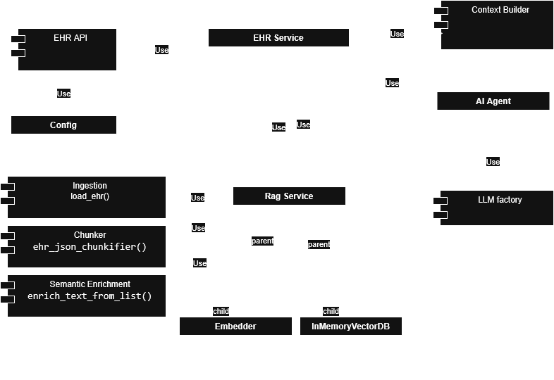

# EHR AI Assistant – Context Engineering Pipeline

[](https://github.com/Braslynrr/ehr-ai-context-pipeline/actions/workflows/ci.yml)

## Overview

This project implements a context engineering pipeline that enables an AI agent to assist clinicians during medical consultations.
The system ingests Electronic Health Records (EHR), structures the information into contextual chunks, retrieves relevant data based on a clinician’s query, and generates grounded, traceable answers using a Large Language Model (LLM).

This system is intentionally designed as a single-user, on-demand assistant. It does not aim to support concurrent users or large-scale request handling.
EHR ingestion is triggered by user interaction and replaces the in-memory context when a different patient is selected.

The focus of this implementation is clarity, traceability, and end-to-end functionality, rather than production-level optimization.

## System Goals

* Provide context-aware clinical answers

* Maintain traceability to the original EHR source

* Demonstrate a complete RAG-style pipeline

* Keep the system simple, explainable, and extensible

## High-Level Architecture

        EHR JSON
           │
           ▼
        [ Ingestion ]
           │
           ▼
        [ Chunking ]
           │
           ▼
        [ Context Enrichment ]
           │
           ▼
        [ Embedding ]
           │
           ▼
        [ In-Memory Vector Store ]
           │
           ▼
        [ Retrieval ]
           │
           ▼
        [ Context Builder ]
           │
           ▼
        [ LLM Agent ]
           │
           ▼
        Answer + Sources

## UML Diagram

The following UML diagram illustrates the high-level relationships between
core modules in the system.

It emphasizes:

- Clear module boundaries
- Dependency direction
- Separation between configuration, services, and agents




## Core Components
### 1. Ingestion Pipeline

The ingestion pipeline loads raw EHR data in JSON format without modifying its original structure.

Responsibilities:

* Load EHR files

* Validate basic structure

* Pass raw data to the chunking stage

Design decision:

* The original EHR structure is preserved to reflect real-world constraints where data normalization is often infeasible.

* Ingestion performs minimal validation only. Any missing or optional fields are handled downstream to avoid early failures
and to reflect real-world incomplete medical records.

* Ingestion is performed on demand based on user selection. When a clinician selects a different patient, the previously ingested EHR is discarded
and a new ingestion pipeline is executed.

### 2. Chunking Strategy

The JSON EHR is split into semantically meaningful chunks based on clinical sections:

* Demographics

* Medical history

* Current Medications

* Chronic Conditions

* Allergies

* Visits

* Lab results

Each chunk contains:

* Type of section

* Optional date

* Human-readable text representation

Example chunk:

```json
   {
   "type": "recent_visit",
   "content": "Fasting glucose: 128 mg/dL. Blood pressure: 135/85. Losartan dosage adjusted.",
   "date": "2024-10-15",
   "doctor": "Dra. Martínez",
   "source": "Appointment (2024-10-15) with Dra. Martínez"
   }
```

Note: Example content may appear in Spanish or English, reflecting real-world EHR variability.

* Design decision:

* Chunking by clinical meaning, not by token size.
This improves interpretability and grounding.

* Chunking is defensive by design.
Missing fields do not cause failures; instead, chunks are generated using
only the available information.

This ensures robustness when working with partial or sparse EHR data.

### 3. Context Enrichment (for Embeddings)

Before embedding, each chunk is enriched with lightweight semantic hints
based on its clinical section.

This compensates for sections that lack sufficient standalone context
(e.g. lab results, visits) and improves embedding quality without modifying
the original data.

This ensures embeddings remain effective even when:

* Field names and the content are in different languages

* The content lacks sufficient contextual information for reliable embedding similarity

Design decision:

* Enrichment is applied only to the text used for embeddings, not to the original data.

* Enrichment is implemented using a static, explicit section-to-hint mapping
  (bilingual Spanish/English). This approach avoids dynamic or model-driven
  enrichment, favoring transparency and reproducibility.

* The mapping is intentionally embedded in code for this exercise but could
  be externalized in a real deployment.

In real-world EHRs, clinical content may appear in different languages or
lack sufficient context on its own. Semantic enrichment bridges this gap
by injecting bilingual contextual hints.

For example, the section type `recent_visit` is enriched using:

```json
{
  "recent_visit": {
    "es": "visita reciente",
    "en": "recent visit"
  }
}
```

### 4. Embeddings & Vector Store

A single embedding per chunk is generated

Embeddings are stored in an in-memory vector store

Design decision:

* Use of Ollama embeddings due to the absence of valid API keys

* No complex embedding hierarchies

* No reranking or cross-encoders

* Use of an in-memory vector store, as the system operates on a single patient at a time and embeddings are loaded on-demand per user selection.

This keeps retrieval transparent and easy to debug

### 5. Retrieval

At query time:

* The question is embedded

* Relevant chunks are retrieved via similarity search

Design decision:

The retriever currently returns a fixed number of chunks (k=2).

This was chosen intentionally:
- It reduces noise in the LLM context
- Improves traceability
- Keeps the system deterministic and explainable
- Empirically works well for the supported clinical queries

Dynamic chunk selection is intentionally deferred.

### 6. Context Builder

The retrieved chunks are:

* Rewritten to reduce token costs without losing important information

* Merged into a structured context

This context is passed to the LLM along with the clinician’s question.

Design decision:

* Context assembly is explicit and deterministic.

* The LLM is not responsible for deciding relevance.

* The context builder is intentionally simple.
Its responsibility is formatting and token reduction, not interpretation.

* Recursive formatting is supported to handle nested structures deterministically.


### 7. LLM Agent

The agent:

* Receives the structured context

* Answers the question using only the provided information

* Produces grounded responses

The system supports:

* Local LLM execution using Ollama

* Pluggable LLM backends

### 8. API Layer

The system exposes a minimal HTTP API using Flask.

Design decision:

* Flask was selected because it is lightweight, easy to reason about, and sufficient
  for demonstrating the end-to-end RAG workflow.

* The API layer is intentionally thin and does not implement advanced concerns
  such as authentication, concurrency control, or request orchestration.

* In a production setting, alternative frameworks (e.g., FastAPI, Django, or
  dedicated inference gateways) would be evaluated based on scalability,
  observability, and deployment requirements.


## Grounding & Traceability

Every answer can be traced back to:

* Section of the EHR

* Visit date or lab date (when applicable)

Example:

    “According to the visit on 2024-10-15, the patient’s fasting glucose was 128 mg/dL.”

This ensures transparency and clinical safety.

## Testing Strategy

The system is covered by unit tests focusing on deterministic behavior:

- Ingestion tests validate file loading and structure handling
- Chunking tests ensure correct chunk generation under partial data
- Enrichment tests verify that semantic context is added when expected
- Retrieval tests validate similarity-based selection functionality
- RAG service tests validate end-to-end flow with mocked components

Non-deterministic components (LLMs, embeddings) are tested indirectly
or mocked to preserve reproducibility.

The goal of testing is correctness and robustness, not model quality.

## EHR Data Format

This project expects EHR files to follow a predefined JSON structure.
Example EHR files are available in the `data/` directory and are used
throughout the provided examples.

The schema is intentionally simple and designed for demonstration purposes.

## Configuration

The system is partially configurable via environment variables using a `.env` file.
This allows changing the LLM provider, model, and EHR data source without modifying
application code, while keeping some parameters (e.g., embedding model and retrieval
top-k) fixed for simplicity.

Create a `.env` file in the project root directory (same level as `pyproject.toml`)
to configure the application.


### Environment Variables

| Variable | Description |
|--------|-------------|
| MEDICAL_EHR_LOCATION | Path to the directory containing EHR JSON files |
| MEDICAL_LLM_PROVIDER | LLM provider (`ollama`, `openai`, `gemini`, etc.) |
| MEDICAL_LLM_MODEL | Model name for the selected provider |
| OPENAI_API_KEY | Required when using OpenAI |
| GOOGLE_API_KEY | Required when using Google Gemini |

### Example `.env`

```env
MEDICAL_EHR_LOCATION=E:\EHR-AI\data
MEDICAL_LLM_PROVIDER=ollama
MEDICAL_LLM_MODEL=qwen3:4b
```

### Switching Providers Example

To use Google Gemini:

```env
MEDICAL_LLM_PROVIDER=gemini
MEDICAL_LLM_MODEL=gemini-1.5-flash
GOOGLE_API_KEY=your_api_key_here
```


## Running the Project
### Prerequisites

- Python 3.10+
- Ollama installed locally ([official download page](https://ollama.com/download))
- The following Ollama models pulled locally:
  - `qwen3:4b` (LLM for answering questions)
  - `nomic-embed-text` (embedding model for retrieval)

Note: `qwen3:4b` can be replaced by any other Ollama-supported model.
It was selected because it is relatively small while still producing
high-quality answers when paired with an effective RAG pipeline.

## Setup

It is recommended to run the project inside a virtual environment to
isolate dependencies and avoid conflicts with other Python projects.

### 1. Create a virtual environment

```bash
python -m venv venv
```

### 2. Activate the virtual environment

#### Windows

```bash
# In cmd.exe
venv\Scripts\activate.bat
# In PowerShell
venv\Scripts\Activate.ps1
```

#### macOS / Linux

```bash
source venv/bin/activate
```

### 3. Install dependencies

```bash
pip install -r requirements.txt
```


### 4. Pull Required Ollama Models

Ensure the required models are available locally:

```bash
ollama pull qwen3:4b
ollama pull nomic-embed-text
```

You can verify available models with:

```bash
ollama list
```

## 5. Start Ollama

Make sure the Ollama service is running:

```bash
ollama run qwen3:4b
```

### 6. Run the Application

In a separate terminal, run the application:

```bash
python main.py
```

## 7. Quick Sanity Check

Once the application is running, you should see:

- Flask server running on `http://127.0.0.1:5000`
- No errors related to missing models or environment variables

You can verify the API by sending a test request to `/ask`.


### 8. API Request Example

POST /ask

```json
{
  "patient": "P001",
  "question": "How has the patient's glucose evolved?"
}
```

## Examples

See the following real execution examples using the full pipeline and a local LLM:

- [Medication query (English)](examples/medication_query.md)
- [Recent visit query (English)](examples/recent_visit_query.md)
- [Consulta clínica en español](examples/spanish_clinical_query.md)

Notes:
- No language-specific prompt tuning or routing was applied
- The response is fully driven by retrieved EHR context
- The same pipeline is used for all languages

## Trade-offs & Limitations

- The provided EHR data is fully synthetic and written in Spanish to avoid the use of real patient information.
- As a result, example queries and responses perform best in Spanish, which is the language of the source records.
- English queries are supported by the pipeline but may retrieve slightly less relevant context due to cross-lingual embedding limitations.
- Design for demo purposes
- Interfaces and abstractions were intentionally minimized, as they were not required for the core functionality.
- No large architectural patterns (e.g., repositories, ports/adapters) were introduced to avoid unnecessary complexity.
- The system is designed for single-user interaction and does not handle concurrent sessions.
- EHR ingestion is performed on demand and replaces the current in-memory state.
- Vector store is in-memory (non-persistent)
- No advanced reranking or hybrid search
- Different LLM providers may produce slightly different answers due to model behavior, even when using the same context.
- CI runs unit tests only. End-to-end execution requires a local Ollama setup.

## Future Improvements

* Persistent vector database

* Reranking with cross-encoders

* Query rewriting for complex questions

* Global retrieval queries

* More configurable options (Embeddings)

* Access control

* Audit logging

## Conclusion

This project demonstrates a complete, explainable context engineering pipeline
for medical question answering.

It prioritizes clarity, traceability, and modularity over optimization, making
it suitable as a reference architecture for clinical RAG systems, educational
purposes, or early-stage prototypes.

Based on empirical experimentation, the results show that model size is not a
critical factor as long as the RAG pipeline retrieves accurate and relevant
context. Even when using a relatively small local model via Ollama (~1.2 GB),
the system was able to generate coherent and medically meaningful answers when
the retrieved information was correct.
